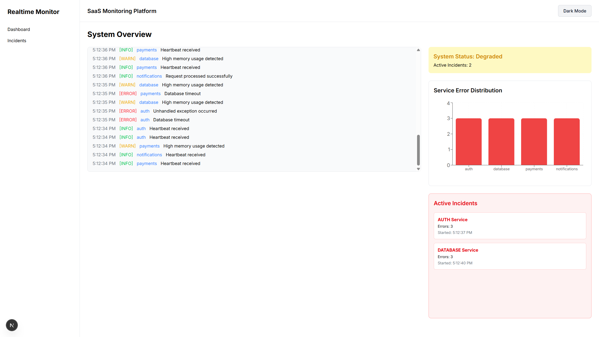
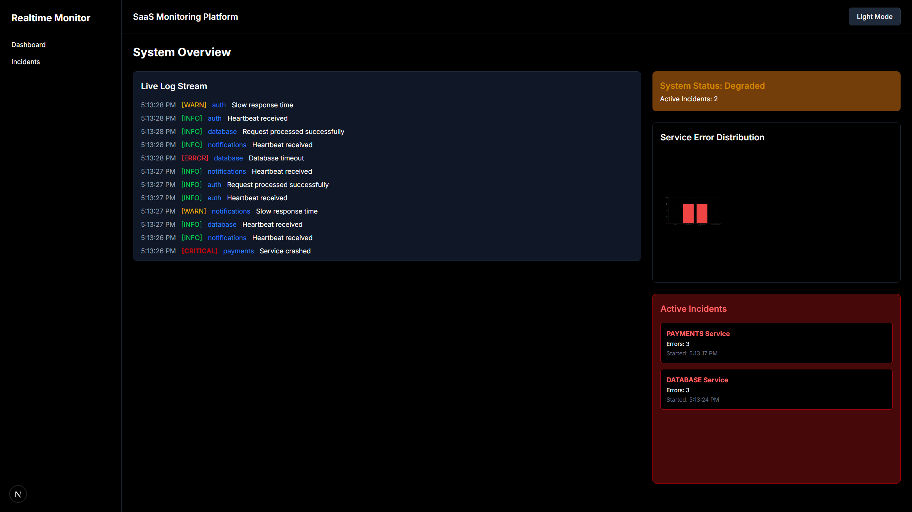
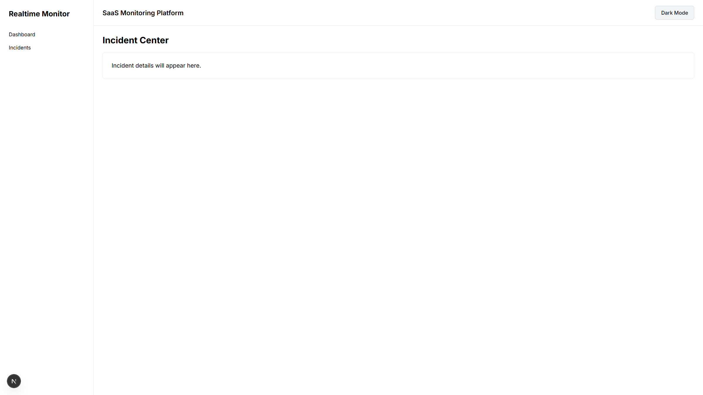

# 🚀 Real-Time Log Monitoring & Intelligent Incident Detection Platform

A real-time monitoring dashboard that streams logs from simulated microservices, applies sliding window anomaly detection, automatically manages incident lifecycle, and visualizes system health dynamically.

---

## 📌 Overview

Modern applications are built using multiple interconnected services. When one service begins to fail, it can impact the entire system. Monitoring and detecting these failures early is critical.

This project simulates how real-world observability platforms analyze logs in real time, detect abnormal behavior, and provide actionable system health insights.

The platform:

- 📜 Streams logs continuously  
- 🚨 Detects abnormal error spikes  
- 🔄 Automatically triggers and resolves incidents  
- 🟢 Displays real-time system health  
- 📊 Visualizes service-level error distribution  
- 🌗 Supports light and dark themes  

It models core concepts used in tools like Datadog, New Relic, and Splunk.

---

## 🧠 Problem It Solves

Without monitoring:

- Errors go unnoticed  
- Failures propagate silently  
- Downtime increases  
- User experience degrades  

This system transforms raw log data into meaningful insights by detecting anomalies and presenting system status clearly and dynamically.

---

## ⚙️ How It Works

### 1️⃣ Log Generation

Simulated backend services generate logs continuously.

Services:
- `auth`
- `database`
- `payments`
- `notifications`

Each log contains:
- Service name
- Log level (INFO, WARN, ERROR, CRITICAL)
- Timestamp
- Message

---

### 2️⃣ Real-Time Streaming

Logs are streamed to the dashboard and rendered live.

The UI updates continuously to simulate real production monitoring environments.

---

### 3️⃣ Sliding Window Detection Engine

The system maintains a rolling 10-second time window of logs.

Detection logic:
- Counts ERROR and CRITICAL logs
- If error count exceeds threshold → 🚨 Incident triggered
- If error rate drops below threshold → ✅ Incident auto-resolved

This mimics real anomaly detection behavior used in observability platforms.

---

### 4️⃣ Incident Lifecycle Management

Each incident:

- Tracks affected service
- Stores start time
- Tracks error count
- Resolves automatically when conditions stabilize

Active incidents are stored in memory and reflected in the UI instantly.

---

### 5️⃣ System Health Abstraction

System health is derived from active incident count:

- 🟢 Healthy → No active incidents  
- 🟡 Degraded → 1–2 active incidents  
- 🔴 Critical → Multiple active incidents  

This abstraction converts complex log data into a simple, understandable system state.

---

### 6️⃣ Visualization Layer

The dashboard includes:

- 📜 Live Log Stream  
- 🚨 Active Incident Panel  
- 📊 Service Error Distribution Chart  
- 🟢 Dynamic Health Indicator  
- 🌗 Dark / Light Mode Toggle  

---

## 🏗️ Architecture

- src/
- app/
- api/logs/route.ts → Log API
- dashboard/page.tsx → Main Dashboard
- incidents/page.tsx → Incident View
- components/
- LogStream.tsx
- IncidentPanel.tsx
- HealthIndicator.tsx
- ServiceMetrics.tsx
- ThemeToggle.tsx
- services/
- detectionEngine.ts → Anomaly detection logic
- logGenerator.ts → Log simulation
- constants/
- services.ts → Centralized service list
- types/
- log.ts
  
---


### Key Layers

- `services/` → Core detection & simulation logic  
- `constants/` → Centralized configuration  
- `types/` → Strong typing for safety and clarity  
- `components/` → Modular UI architecture  

---

## 🛠️ Technologies Used

### Frontend
- ⚛️ Next.js (App Router)
- 🟦 TypeScript
- 🎨 Tailwind CSS
- 📊 Recharts
- 🌗 next-themes

### Engineering Concepts
- Real-time data streaming
- Sliding window analysis
- Threshold-based anomaly detection
- Auto-resolving incident lifecycle
- State lifting architecture
- Modular service-based structure
- Client/Server component separation

---

## 🔍 Core Engineering Concepts Demonstrated

- Sliding Time Window Analysis  
- Real-Time UI Updates  
- Incident Lifecycle Modeling  
- Service-Level Aggregation  
- Dynamic Health Abstraction  
- Clean Architectural Separation  

This is not a CRUD application.  
It models real operational system monitoring behavior.

---

## 🖥️ Running Locally

### 1️⃣ Install Dependencies

```bash
npm install
```

### 2️⃣ Start development server

```bash
npm run dev
```

### Visit:

```bash
http://localhost:3000
```
---
## 🎯 Use Cases

This project demonstrates concepts relevant for:

- Full-Stack Development
- Backend Engineering
- DevOps Engineering
- Site Reliability Engineering (SRE)
- Distributed Systems
- SaaS Infrastructure Monitoring

---

## 📈 Future Enhancements

- WebSocket-based real-time streaming
- Persistent incident history
- Severity scoring algorithm
- Multi-service correlation detection
- Authentication & protected dashboard
- Historical trend line charts
  
---

## 📄 One-Line Summary

A real-time monitoring and incident detection platform that streams logs from simulated microservices, applies sliding window anomaly detection, automatically manages incident lifecycle, and visualizes system health dynamically.

---

## 👨‍💻 Author

Built as a demonstration of real-time monitoring architecture, anomaly detection logic, and observability dashboard design using modern web technologies.

---

## 📷 Screenshots

### 🌗 Dashboard — Light Mode



---

### 🌙 Dashboard — Dark Mode



---

### 🚨 Active Incidents View



---
